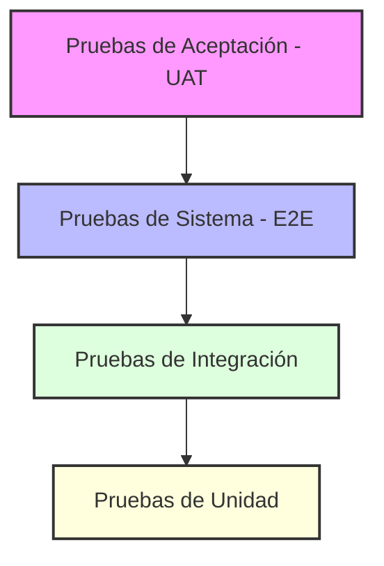

<table style="width: 100%; border: none; border-collapse: collapse; background-color: transparent;">
  <tr style="border: none; background-color: transparent;">
    <td style="width: 120px; border: none; padding: 10px; vertical-align: middle; background-color: transparent;">
      
    </td>
    <td style="border: none; padding: 10px; vertical-align: middle; line-height: 1.5; background-color: transparent;">
      <h2 style="margin: 0; color: #1e3a8a; font-family: Arial, sans-serif; font-weight: bold;">
        Pontificia Universidad Católica del Ecuador Sede Manabí
      </h2>
      <h3 style="margin: 5px 0 0 0; color: #475569; font-family: Arial, sans-serif; font-weight: normal;">
        Carrera de Ingeniería de Software
      </h3>
    </td>
  </tr>
</table>

---

# Guía de Estudio: Pruebas de Software (Software Testing)

* **Asignatura:** Desarrollo de Sistemas de Información
* **Docente:** Ing. José Naranjo, M.Eng.
* **Período:** 2026-1 | Parcial 31

---

Esta guía ha sido diseñada para ayudarte a dominar los conceptos fundamentales de las **Pruebas de Software** y su aplicación práctica en entornos de desarrollo reales utilizando Python.

---

## 1. Fundamentos Teóricos

### ¿Qué es una prueba de software?
Una **prueba de software** es un proceso técnico que consiste en ejecutar un programa o aplicación con el objetivo explícito de verificar que se comporte según lo esperado y encontrar fallas (bugs o defectos). Se trata de comparar el **comportamiento real** del software contra el **comportamiento esperado** definido por los requerimientos del negocio.

### Objetivos de las pruebas de software
Las pruebas no se realizan únicamente para encontrar errores. Sus objetivos principales son:
1. **Prevenir defectos**: Identificar problemas a tiempo antes de que el código llegue a producción.
2. **Generar confianza**: Garantizar al cliente y a los desarrolladores que el sistema funciona correctamente.
3. **Validación y Verificación**:
   - *Verificación*: ¿Estamos construyendo el sistema correctamente? (Cumplir con las especificaciones técnicas).
   - *Validación*: ¿Estamos construyendo el sistema correcto? (Satisfacer las necesidades reales del usuario).
4. **Proporcionar información**: Ayudar a los tomadores de decisiones a evaluar el nivel de calidad del producto.
5. **Facilitar la refactorización**: Permitir mejorar el código interno con la seguridad de que no romperemos características existentes.

---

## 2. Los Niveles de Pruebas (Pirámide de Pruebas)

En la ingeniería de software, las pruebas se estructuran en diferentes niveles según su alcance e integración.



### A. Pruebas de Unidad (Unit Tests)
* **Definición**: Prueban el componente más pequeño y aislado del software, usualmente una función, método o clase de forma individual.
* **Aislamiento**: Se debe aislar la unidad de cualquier dependencia externa (como bases de datos, APIs o incluso otras clases) utilizando técnicas de simulación como **Mocks** (objetos simulados).
* **Características**: Son extremadamente rápidas de ejecutar y muy baratas de desarrollar.

### B. Pruebas de Integración (Integration Tests)
* **Definición**: Verifican que dos o más módulos u objetos del sistema interactúan y funcionan correctamente entre sí.
* **Enfoque**: Evalúan el flujo de datos y las interfaces de comunicación entre componentes del software que ya han sido probados unitariamente.
* **Características**: Pueden requerir la configuración de pequeños entornos de prueba con dependencias reales.

### C. Pruebas de Sistema (System Tests / E2E)
* **Definición**: Evalúan el comportamiento de la aplicación completa de extremo a extremo (End-to-End).
* **Enfoque**: Se comprueba que todo el sistema integrado cumpla con los requisitos especificados globales, incluyendo rendimiento, interfaces de usuario, red y flujos completos.

### D. Pruebas de Aceptación (UAT - User Acceptance Tests)
* **Definición**: Son las pruebas finales de validación realizadas para determinar si el sistema está listo para ser entregado.
* **Enfoque**: Se basan en escenarios reales de negocio y verifican si el sistema satisface las expectativas y necesidades operativas del usuario final o del cliente.
* **Características**: Tradicionalmente se ejecutan de manera manual por el cliente, pero hoy en día muchas partes clave se automatizan mediante flujos basados en comportamiento (BDD).

---

## 3. Preguntas de Autoevaluación (¡Examen Rápido!)

> **Pregunta 1:** ¿Qué prueba verifica que dos módulos funcionan juntos?
> <details>
> <summary><b>Ver Respuesta Correcta</b></summary>
>
> La **Prueba de Integración**. Su propósito fundamental es asegurar que los datos fluyan correctamente y las llamadas entre diferentes módulos o servicios funcionen según lo diseñado sin generar inconsistencias.
> </details>

> **Pregunta 2:** ¿Cuál prueba realiza el cliente antes de aceptar el sistema?
> <details>
> <summary><b>Ver Respuesta Correcta</b></summary>
>
> La **Prueba de Aceptación (UAT - User Acceptance Testing)**. El cliente o usuario de negocio valida que el software resuelva sus problemas operativos y cumpla con las "Historias de Usuario" acordadas contractualmente antes de dar luz verde para su despliegue final en producción.
> </details>

---

## 4. Proyecto Práctico: Librería Virtual (`bookstore`)

Para aplicar estos conceptos de manera práctica, hemos estructurado un proyecto de software en Python que representa el backend de una librería virtual.

### Arquitectura de la Aplicación
El código de producción se encuentra en el directorio [bookstore] y consta de tres componentes:

1. **Gestión de Stock**: [`inventory.py`] Contiene la clase `Inventory` encargada de mantener el inventario de libros con sus precios y reducir existencias.
2. **Gestión de Carrito**: [`cart.py`] Contiene la clase `Cart` que registra qué libros desea comprar el usuario y colabora con el inventario para calcular el costo total.
3. **Procesador de Compras**: [`order_processor.py`] Contiene la clase `OrderProcessor` (que valida stock, realiza cargos en una pasarela de pago virtual y descuenta el stock final) y la clase simulada `PaymentGateway`.

---

## 5. Implementación Paso a Paso de las Pruebas

Toda nuestra suite de pruebas está ubicada en el directorio [tests]. Analizaremos cómo se implementó cada nivel utilizando el módulo estándar `unittest` de Python.

### Paso 1: Pruebas Unitarias
Revisa el archivo [`test_unit.py`].

* **Concepto clave**: Aislamiento total. 
* **Ejemplo práctico**: Cuando probamos la lógica para calcular el total de un carrito (`Cart.get_total`), no queremos que un error en el módulo de Inventario real rompa la prueba del Carrito. Por ello, utilizamos un **Mock** de inventario:

```python
from unittest.mock import Mock

def test_cart_get_total_with_mock_inventory(self):
    cart = Cart()
    cart.add_item("111-222", 2)
    
    # Creamos un simulador de la clase Inventory
    mock_inventory = Mock()
    # Programamos para que cuando pregunte por el precio retorne $10.0
    mock_inventory.get_price.return_value = 10.0
    
    total = cart.get_total(mock_inventory)
    self.assertEqual(total, 20.0)
```

### Paso 2: Pruebas de Integración
Revisa el archivo [`test_integration.py`].

* **Concepto clave**: Colaboración real.
* **Ejemplo práctico**: Validamos que al invocar `checkout()` de la clase `OrderProcessor`, se actualicen los niveles reales de stock dentro de la clase `Inventory`. Aquí no mockeamos el inventario; interactúan las instancias reales para garantizar que los módulos se entienden perfectamente entre sí.

### Paso 3: Pruebas de Sistema
Revisa el archivo [`test_system.py`].

* **Concepto clave**: Simulación del entorno de producción.
* **Ejemplo práctico**: Ejecutamos el flujo completo de una compra: poblar la librería, crear un carrito, añadir y remover libros, realizar el checkout final y pagar en la pasarela de pagos simulada real, verificando los stocks finales de todos los libros agregados a la base de datos de inventario.

### Paso 4: Pruebas de Aceptación (UAT)
Revisa el archivo [`test_uat.py`].

* **Concepto clave**: Historias de usuario y criterios de aceptación.
* **Ejemplo práctico**: En lugar de verificar detalles técnicos internos de base de datos, escribimos la prueba simulando un comportamiento exacto del cliente comprador y el administrador.
  - **Dado que** (Given) existen 5 unidades de un libro.
  - **Cuando** (When) el cliente realiza la orden por 2.
  - **Entonces** (Then) la orden se concreta por $40.00 y quedan 3 en inventario.

---

## 6. Cómo Ejecutar la Suite de Pruebas

Para ejecutar las pruebas en tu computadora, abre una terminal en el directorio raíz del proyecto y corre el comando nativo de Python para descubrimiento de pruebas:

```bash
python -m unittest discover -s tests -p "test_*.py" -v
```

El parámetro `-v` (verbose) mostrará el detalle de qué prueba exacta se está ejecutando y su estado final (`ok` o `FAILED`).

---

## 7. Ejercicio Práctico para el Estudiante (Tu Reto)

Para validar que has comprendido el funcionamiento y el flujo de los distintos niveles de pruebas, deberás implementar una nueva funcionalidad: **Cupones de Descuento**.

### Requisitos del Negocio (Criterios de Aceptación)
1. Un cliente puede ingresar un cupón de descuento en el carrito de compras.
2. Si el cupón es `"DESCUENTO10"`, se debe aplicar un **10% de descuento** sobre el costo total del carrito.
3. Si el cupón ingresado no existe o no es válido, no se aplicará ningún descuento.

### Instrucciones del Paso a Paso para el Estudiante:

1. **Modifica el código de la aplicación**:
   - En [`cart.py`], añade un atributo `self._discount_code = None` en el inicializador `__init__`.
   - Agrega un método `apply_coupon(self, code: str)` que guarde el cupón.
   - Modifica el método `get_total(self, inventory)` para aplicar una rebaja del 10% si `self._discount_code == "DESCUENTO10"`.

2. **Escribe y ejecuta las pruebas de todos los niveles**:
   - **Prueba Unitaria**: Añade una prueba en `TestCart` ([`test_unit.py`]) llamada `test_cart_get_total_with_discount_coupon_using_mock` que verifique que el descuento del 10% se calcula adecuadamente aislando `Inventory` con un Mock.
   - **Prueba de Integración**: Modifica [`test_integration.py`] para asegurar que el `OrderProcessor` cobre el monto descontado cuando se procesa la compra del carrito usando un inventario real.
   - **Prueba de Aceptación (UAT)**: Agrega un nuevo escenario en [`test_uat.py`] titulado `test_uat_compra_con_descuento_exitoso` que siga este flujo narrativo:
     * **Dado** que tengo en inventario 'El Principito' con 1 unidad a $10.00.
     * **Cuando** el cliente lo agrega al carrito, aplica el cupón `'DESCUENTO10'` y completa el checkout.
     * **Entonces** el cobro final realizado debe ser exactamente por $9.00 y el stock debe quedar en 0.

3. **Ejecuta las pruebas** para validar que todo funcione:
   ```bash
   python -m unittest discover -s tests -p "test_*.py" -v
   ```
# santos_alex_actividad3

